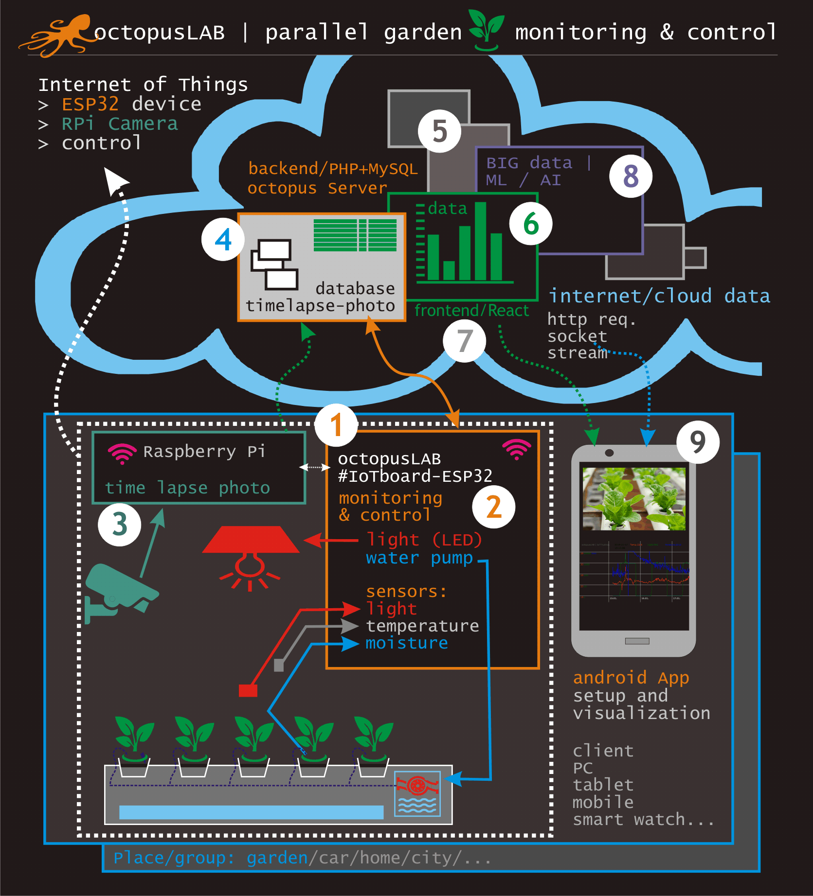
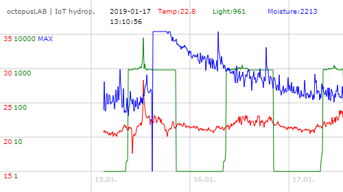
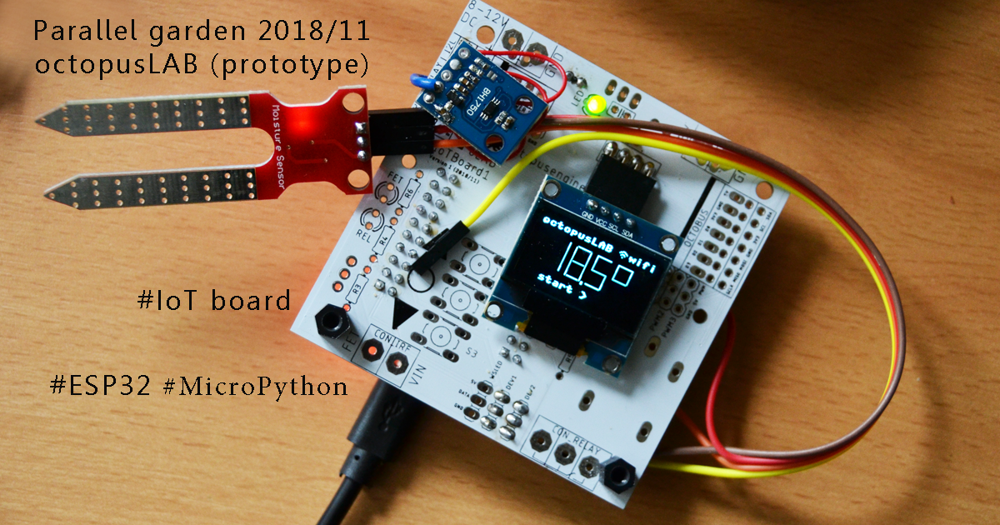
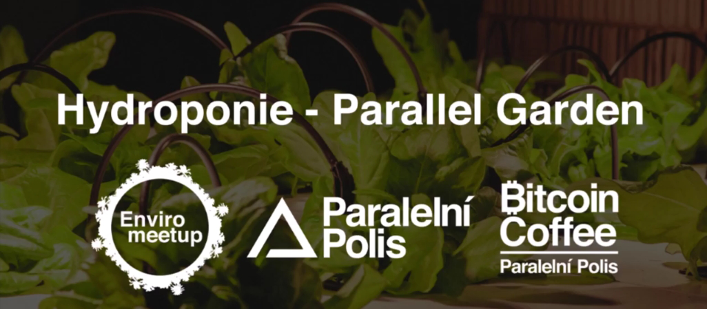

# octopusLAB_parallel_garden
Parallel garden project - IoT and hydroponics monitoring

with #IoTboard (octopusLAB)
---

(1) iot-board-hw-esp32 > https://github.com/octopusengine/octopusLAB_parallel_garden/tree/master/iot-board-hw-esp32

(2) iot-board-micropython-esp32 > https://github.com/octopusengine/octopusLAB_parallel_garden/tree/master/iot-board-micropython-esp32

(3) rpi-timelapsephoto > https://github.com/octopusengine/octopusLAB_parallel_garden/tree/master/rpi-timelapsephoto

(4) server-mysql > https://github.com/octopusengine/octopusLAB_parallel_garden/tree/master/server-mysql

(5) server-db ? grafana

(6) frontend - react >> https://github.com/octopusengine/octopusLAB_parallel_garden/tree/master/frontend

(7) frontend ? grafana

(8) AI / ML / future... > https://github.com/octopusengine/octopusLAB_parallel_garden/tree/master/ai-ml-future

(9) android app >> https://github.com/octopusengine/octopusLAB_parallel_garden/tree/master/android-app

---

Monitoring of basic values:

## history:
<pre>
2018/05 octopusLAB IoT board prototype
2018/11 - version 1
2018/12 first Alfa testing IoT (ESP32), raspberry Pi (camera), server (MysQL, PHP, JS canvas)
2019/01 Beta test - edition with: temperature, moisture and light monitoring (MicroPython)
2019/02 octopusLAB - first mini box testing (12V edition: & PWM LED control, Relay - pump)
2019/03 Paper Hub (Paralelni Polis - Prague) - prepare next edition 
> 2019/04 - 3-5 boxes?
</pre>

---
Main project >

https://github.com/ParallelGarden/Hydroponics-in-a-box

This project consists of two projects that form a compatible outcome product: hydroponics system itself, and IoT device that is being developed in order to collect data about the growing process, optimize costs, and eventually to take control over the system.

---
## Contribute
You are welcome to contribute to this repository by providing documentation to code, submitting issue reports, enhancement requests and pull requests.

