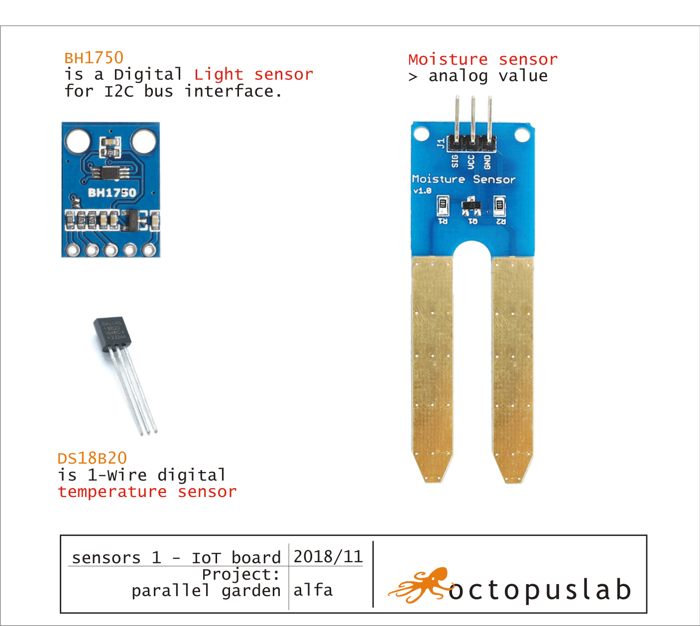

# octopusLAB_parallel_garden
parallel garden project - IoT and hydroponics monitoring

with #IoTboart (octopusLAB)

---
Monitoring of basic values:

## history:
<pre>
2018/05 octopusLAB IoT board prototype
2018/11 - version 1
2018/12 first Alfa testing IoT (ESP32), raspberry Pi (camera), server (MysQL, PHP, JS canvas)
2019/01 Beta test - edition with: temperature, moisture and light monitoring (MicroPython)
> 2019/03 - 12V edition: & PWM LED control, Relay - pump
</pre>

---

---
Main project >

https://github.com/ParallelGarden/Hydroponics-in-a-box

This project consists of two projects that form a compatible outcome product: hydroponics system itself, and IoT device that is being developed in order to collect data about the growing process, optimize costs, and eventually to take control over the system.

---
## Contribute
You are welcome to contribute to this repository by providing documentation to code, submitting issue reports, enhancement requests and pull requests.

